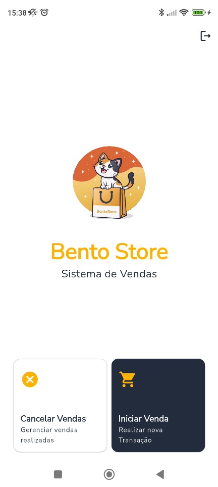
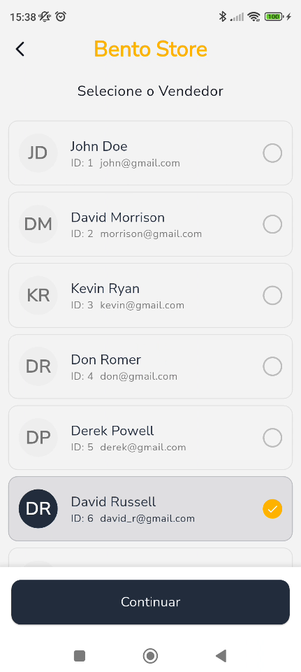

# 🏪 Bento Store - Sistema de Venda

<div align="center">


[](https://flutter.dev/)
[](LICENSE)
[](https://pub.dev/packages/flutter_lints)

</div>

## 📱 Visão Geral

O BentoStore é uma aplicação moderna de Ponto de Venda (POS) desenvolvida com Flutter, projetada
para oferecer uma experiência fluida e intuitiva para comerciantes. Com uma interface elegante e
recursos poderosos, o BentoStore simplifica o processo de vendas e gestão do seu negócio.

## 🚀 Funcionalidades

- 🛍️ **Gestão de Vendas**
    - Tela de seleção do vendedor
    - Tela de seleção dos produtos
    - Tela de resumo com as opções de pagamento(somente pagamento em dinheiro implementado)
    - Tela de pagamento em dinheiro

- 📊 **Gestão administrativa**
    - Tela de login
    - Tela com as opções administrativas(somente cancelamento de vendas implementado)
    - Tela de cancelamento de vendas

## 🧑‍💻 Tecnologias Utilizadas

- **Flutter** `^3.7.0` - Framework UI
- **Bloc** `^8.1.0` - Gerenciamento de Estado
- **GetIt** `^7.6.0` - Injeção de Dependências
- **Dio** `^5.3.0` - Cliente HTTP
- **Flutter Secure Storage** `^9.0.0` - Armazenamento Seguro
- **Google Fonts** `^6.1.0` - Tipografia
- **Flutter Screenutil** `^5.9.0` - Responsividade

## 🌐 API

Este projeto utiliza a [Fake Store API](https://fakestoreapi.com/) para demonstração:

- **Base URL:** `https://fakestoreapi.com`
- **Endpoints utilizados:**
    - `GET /products` - Lista de produtos
    - `GET /carts` - Carrinho de compras
    - `POST /carts` - Criar nova venda

> **Nota:** Para uso em produção, substitua pela sua API real.

## ⚙️ Como Rodar o Projeto

## ⚙️ Como Rodar o Projeto

### Pré-requisitos

- [Flutter SDK](https://flutter.dev/docs/get-started/install) 3.7+
- [Dart SDK](https://dart.dev/get-dart) ^3.7.2
- [Git](https://git-scm.com/)
- [Android Studio](https://developer.android.com/studio)
  ou [VS Code](https://code.visualstudio.com/)

### Passo a Passo

1. **Clone o repositório**

```bash
git clone https://github.com/seu-usuario/bentostore.git
cd bentostore

2. Instale as dependências

```bash
flutter pub get
```

3. Execute o projeto

```bash
flutter run
```

### **4. Adicionar seção de contribuição:**

```markdown
## 🤝 Como Contribuir

1. Faça um fork do projeto
2. Crie uma branch para sua feature (`git checkout -b feature/AmazingFeature`)
3. Commit suas mudanças (`git commit -m 'Add some AmazingFeature'`)
4. Push para a branch (`git push origin feature/AmazingFeature`)
5. Abra um Pull Request

### 📋 Padrões de Código

- Siga as [convenções do Dart](https://dart.dev/guides/language/effective-dart)
- Use `flutter analyze` para verificar o código
- Execute `flutter test` antes de fazer commit
- Mantenha a cobertura de testes acima de 80%

## 🗺️ Roadmap

### ✅ Implementado

- [x] Sistema de autenticação
- [x] Gestão de vendas
- [x] Pagamento em dinheiro
- [x] Cancelamento de vendas

### 🚧 Em Desenvolvimento

- [ ] Múltiplas formas de pagamento (PIX, Cartão)
- [ ] Relatórios de vendas
- [ ] Gestão de estoque
- [ ] Sistema de usuários

### 🔮 Futuro

- [ ] Integração com impressoras térmicas
- [ ] App para iOS
- [ ] Dashboard web
- [ ] API própria
```

## 📸 Capturas de Tela

##### - Fluxo de vendas

<div align="center">

|                        |                     |                      
|-------------------------------------------------------------------------------|--------------------------------------------------------------------------|---------------------------------------------------------------------------------|
| --------------------------------------------------------------                | ------------------------------------------------------------------------ | ------------------------------------------------------------------------------- |
|                   |    |    
| --------------------------------------------------------------                | ------------------------------------------------------------------------ | ------------------------------------------------------------------------------- |
|  
| --------------------------------------------------------------                | ------------------------------------------------------------------------ | ------------------------------------------------------------------------------- |

</div>

##### - Fluxo Administrativo

<div align="center">

|  |  |  
|---------------------------------------------------------|-------------------------------------------------------|------------------------------------------------------------------------------|

</div>

## 📦 Estrutura de Pastas

```

lib/
├── core/ # Configurações e utilitários core
├── features/ # funcionalidades e recursos
│ ├── data/ # Camada de dados e repositórios
│ ├── domain/ # Regras de negócio e entidades
│ ├── presentation/ # Widgets e telas
│ └── Services/ # Lógicas de negócio e gerenciamento de estado
├── shared/ # Widgets ou outros componentes reutilizáveis
└── main.dart # Ponto de entrada da aplicação

```

## 📄 Licença

Este projeto está licenciado sob a Licença MIT - veja o arquivo [LICENSE](LICENSE) para detalhes.

---

<div align="center">

Desenvolvido carinho por Murilo Nascimento.

</div>
